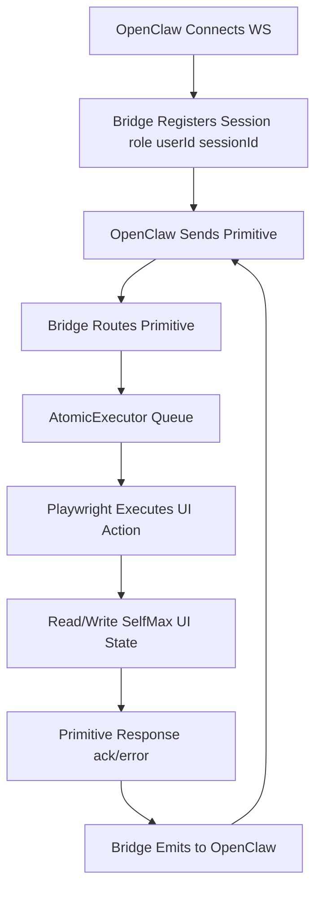
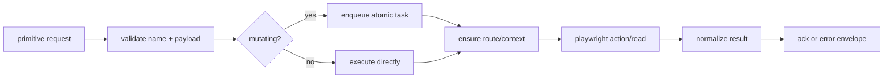
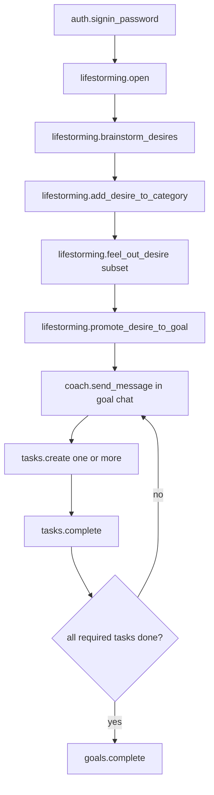
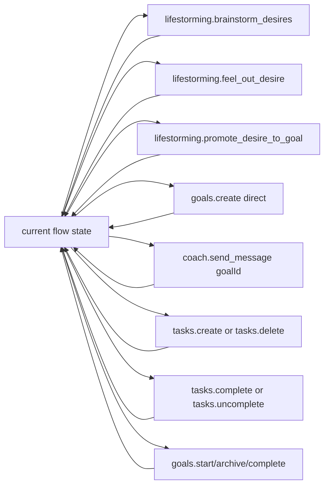
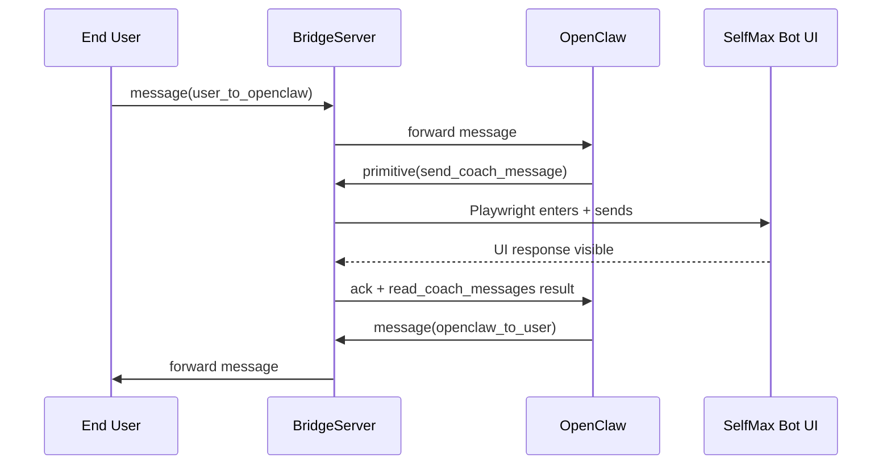
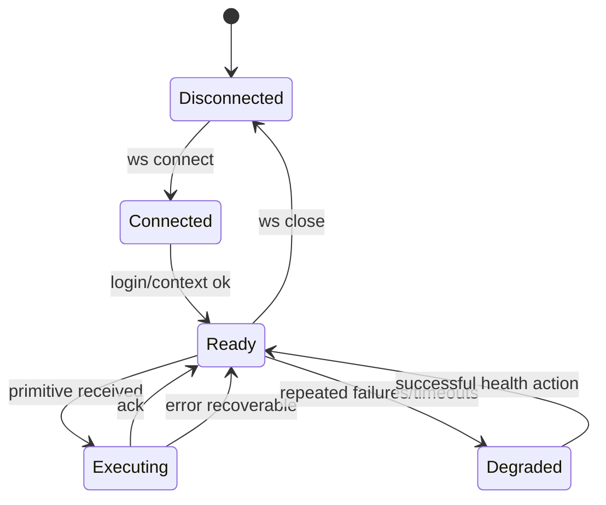
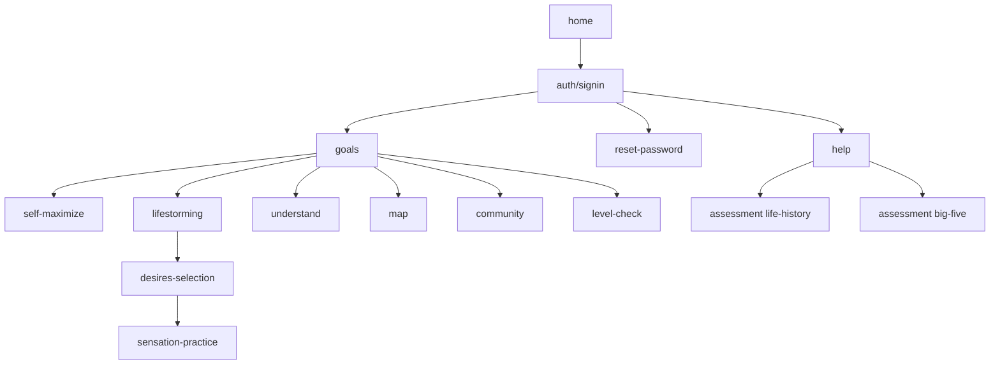

# SelfMax Technical Flow Chart

This document describes the runtime integration flow (OpenClaw <-> Bridge <-> Playwright <-> SelfMax UI).

## Components

- `OpenClaw/Moltbot`: orchestrator that decides next action.
- `BridgeServer` (WebSocket): message bus + primitive endpoint.
- `AtomicExecutor`: per-session mutation serialization.
- `SelfMaxPlaywrightClient`: UI automation driver.
- `SelfMax UI`: state source of truth.

## High-Level Flow

## Primitive Execution Pipeline

## Core Runtime Loop

1. OpenClaw sends `primitive` or `message`.
2. Bridge parses envelope and resolves session scope.
3. For `primitive`:
4. Execute via Playwright (`navigate`, `invoke_known_action`, `get_state`, etc.).
5. Return `ack`/`error` with `correlationId`.
6. OpenClaw decides next primitive from returned state.
7. Repeat until terminal condition (`signout`, session timeout, or external stop).

## Canonical Product Loop (Requested)

Action intent:
- `brainstorm`: generate/capture desire candidates.
- `add items to health/work/etc.`: categorize desires.
- `feel it out`: short validation pass before promoting desire to goal.
- `chat in goal window`: keep coaching thread goal-scoped.

## Anytime Interrupt Paths

At any point in the loop, caller may branch to one of these actions and then return to prior flow state:

Execution rule:
- Integration auto-navigates to required page context, executes atomic action, then returns control to orchestrator.

## Message Passthrough Loop

## Error/Retry Branches

- Parse failure: return `error` with invalid envelope reason.
- Selector failure: return `error` + action ID + route context.
- Auth failure: trigger `navigate(auth)` and `login` retry path.
- Stale context: reload route, then retry once.
- Timeout: mark primitive failed, preserve session, allow caller retry.

## Minimal State Machine (Integration-Level)

## Route Transition Graph (Simplified)

